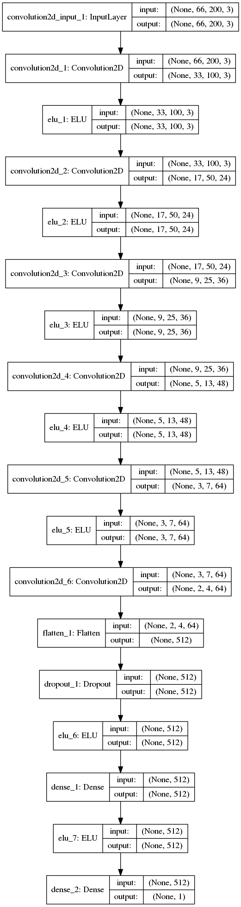
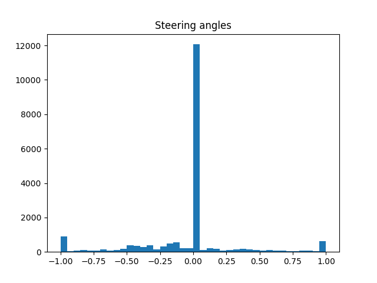
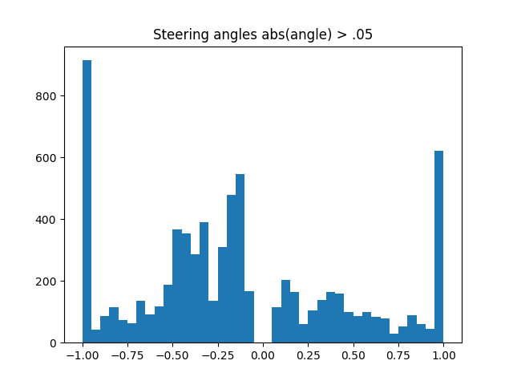
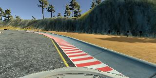
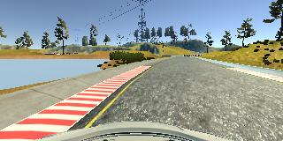

# CarND-Behavioral-Cloning

<h3>
        Solution Design
</h3>

I started off adopting the CommaAI model which produced poor results. I then combined aspects of the NVIDIA model to create a model of my own which finally produced good results. It was a long process of trial and error--trying different things and keeping whatever gave me better results.

<h3>
        Model Architecture
</h3>

This project uses a Keras convolutional neural network with eight layers. After each layer it uses an ELU activation function. The depth of each layer grows as the model progresses while the filter sizes shrink. I introduced a small dropout of 20% to help with overfitting. I also added L2 regularization which also helped with overfitting. The L2 regularization is applied to the deepest layer where it will have the most significant impact. Finally, the model is compiled using the Adam optimizer with a mean squared error loss function. I ended up leaving out normalization which you can see commented out (first layer) because it undoubtedly made my car perform worse. There were times when it would get stuck with normalization but after removing the normalization it would make it around the track multiple times. In this case it makes no difference to me what is standard or what other students are doing. I will favor the model that gives me the best results.

  
Below you will find a graph representation of the model. Also, the size of each layer is listed below.
  

<h3>Training Process</h3>

The training process uses Keras' fit_generator to feed batches of images to the model in order to reduce training time. This significantly sped up the trial and error process of finding the right model. The generator calls a function gen() which shuffles the data and preprocesses the images. The data is shuffled because the training sample size was less than the total training dataset so it's shuffled to ensure all of the data was used. The preprocessing can be found in 'process_line.py'. During the processing stage images are resized which gave better results. Empty Numpy arrays are then created having the size of the batch as their first dimension and the height, width, channel sizes as the other 3 dimensions. It then loops over the input data creating an 'x' batch with the resized images and a 'y' batch for the steering angles. All images which have approximately a zero steering angle are left out. This also gave better results.

  
All of the data was recorded with a keyboard. I did not have the luxury of a joy stick and it was just too difficult to use my mouse pad. This required a fairly large dataset of about 20,000 images. A lot of work was done to balance the steering angles by training the car to recenter when it moved towards the lines. When testing the car did not once cross the side lines. 
  
From the graph below one can see the difference between a dataset including steering angles of zero and one without. Leaving out data with zero steering angles led to much more training on images that mattered. Intuitively this makes sense because the goal is to teach the car proper steering angles and if the angle is non existant then it is irrelevant to the task at hand. 
  

  
Below are sample images that portray the process of balancing the data. I would drive to the edge and start recording so that the training set conists of many images like the ones below. When it is confronted with a situation where it is close to the line it knows to turn pretty sharply (.8 - 1) towards the center of the road. 
  
Steering angle: -.8 (Off center, hard left to recenter) 
  
Steering angle: -.11 (Nearly center, move foward and gradually follow the turn) 
  
Steering angle: .9 (Off center, hard right to recenter) 
  
